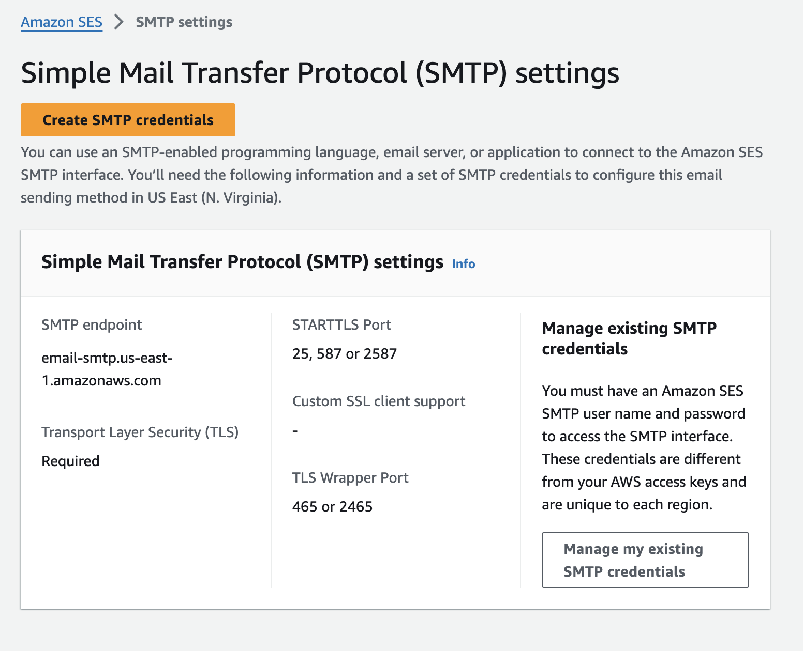

### Speedrun: Setting Up Email with Google Suite and AWS SES

1. **Choose an Email Provider**:

   - To receive emails, you'll need an email provider. I use Google Suite, but you can choose any provider you prefer. In Google Suite, you can set up an "alias domain," which involves a verification step where you need to update your DNS records.

2. **Domain Verification**:

   - If you're using Cloudflare as your DNS manager, Google will automatically recognize it and add the necessary DNS records. If you're using another DNS provider, you may need to add these records manually. After verifying the domain, you may need to go through additional activation steps, such as activating Gmail, which involves configuring MX records in Cloudflare. Again, you might need to do this manually depending on your setup.

   

3. **Setting Up a Catch-All Email**:

   - In Google Suite, I set up a catch-all email so that any email sent to `<anything>@pocketpages.dev` is routed to `ben@pocketpages.dev` if the specific email address doesn’t exist. This is optional, but you might want to consider what happens to unrecognized email addresses in your setup.

4. **Test Your Email Setup**:

   - Send an email to yourself using the new domain to ensure that everything is working correctly. Once this is confirmed, you can proceed to link your setup with Amazon SES.

5. **Linking with Amazon SES**:

   - Log in to your Amazon SES account and follow their getting started guide to create a FROM address and sending domain.
   - You'll need to add DNS records provided by SES to your DNS provider. If you’re using Cloudflare, make sure these records are not proxied.

   

6. **Verifying the Setup**:

   - After adding the DNS records, go back to AWS SES and send a verification email. You should receive it if everything is set up correctly.
   - If verification takes too long, go to **Identities > DKIM** in SES, click **Edit**, then **Save** to trigger an immediate re-verification.

7. **Submit for Approval**:

   - Before you can send emails to anyone, you must submit everything for approval in AWS SES. This step is crucial to avoid issues when sending emails outside your verified domain.

8. **Creating SMTP Credentials**:

   - Create SMTP credentials in the AWS SES console. These credentials will be used in your PocketBase admin panel for sending emails.

   

9. **Configure SMTP in PocketBase**:

   - Enter the SMTP credentials in PocketBase's admin panel, and ensure the **SENDER** address is correctly set. If SES hasn't verified your email yet, you can test it by sending an email to `test@<yourdomain>`, which should go through if the domain is the same.

10. **You're All Set!**:

- You've successfully set up outgoing SMTP with AWS SES, allowing your PocketBase app to send emails.

Setting up email services can be a bit complex, but following these steps ensures that you can receive and send emails through your custom domain using Google Suite and AWS SES.
