# Google OAuth2 Setup Guide

This guide will walk you through setting up Google OAuth2 authentication for your PocketPages application.

> **Note**: PocketPages provides an authentication starter kit that includes pre-built Google OAuth2 integration. You can get started quickly with:
>
> ```bash
> npx tiged benallfree/pocketpages/starters/auth my-auth-app
> cd my-auth-app
> npm i
> ```

## 1. Create/Select Google Cloud Project

1. Go to [Google Cloud Console](https://console.cloud.google.com)
2. Either select an existing project or create a new one
3. If creating new, provide a project name when prompted


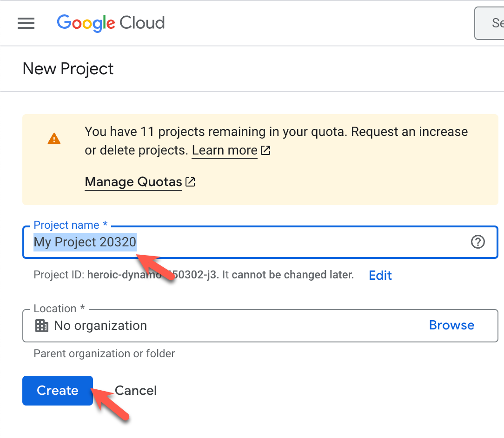
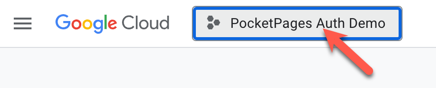

## 2. Configure OAuth Credentials

1. Navigate to "Credentials" in the left sidebar
2. Click "Create Credentials" and select "OAuth client ID"


### Configure Application Type

1. Select "Web application" as the application type
2. Configure your authorized origins and redirect URIs:
   - **Authorized JavaScript origins**: Your application domain (e.g., `http://localhost:8090`)
   - **Authorized redirect URIs**: Your auth callback URL (e.g., `http://localhost:8090/auth/oauth/confirm`)

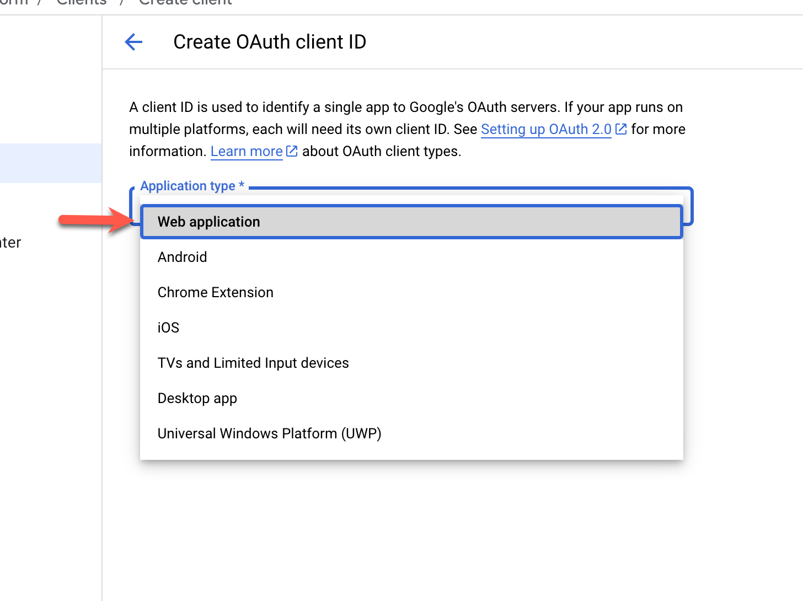
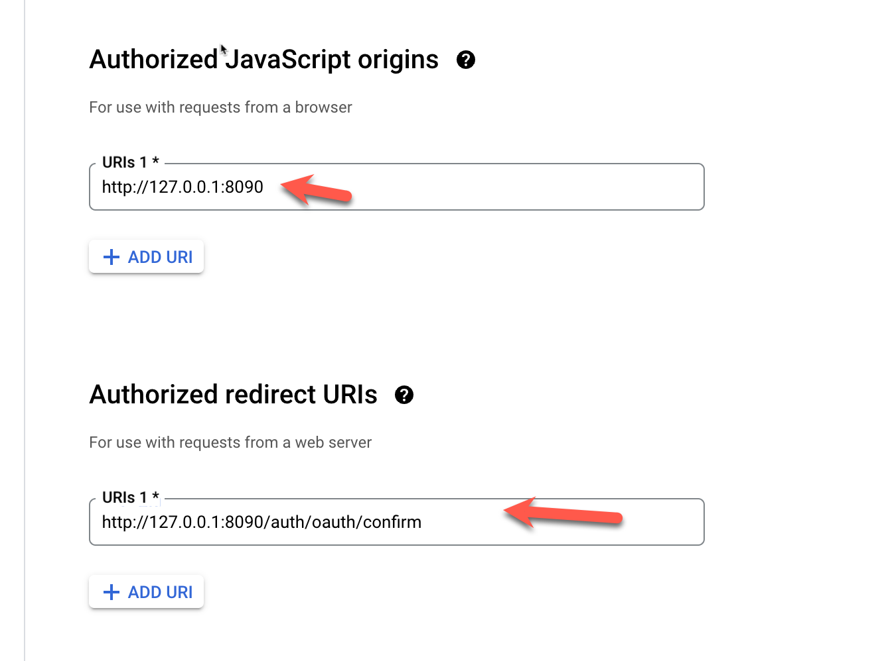

### Configure Consent Screen (if needed)

If you haven't set up a consent screen before, you'll need to configure it:

1. Choose External/Internal user type
2. Fill in the required application information

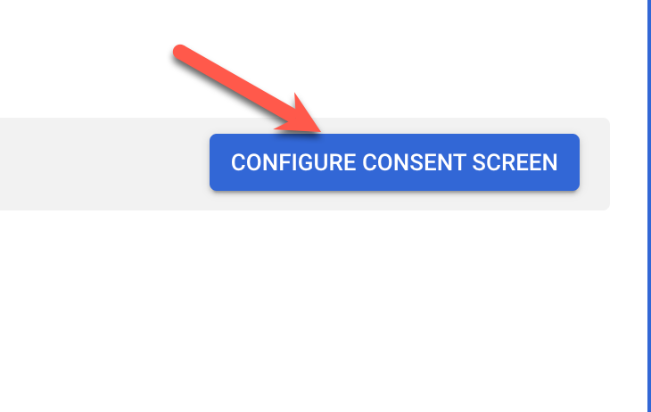
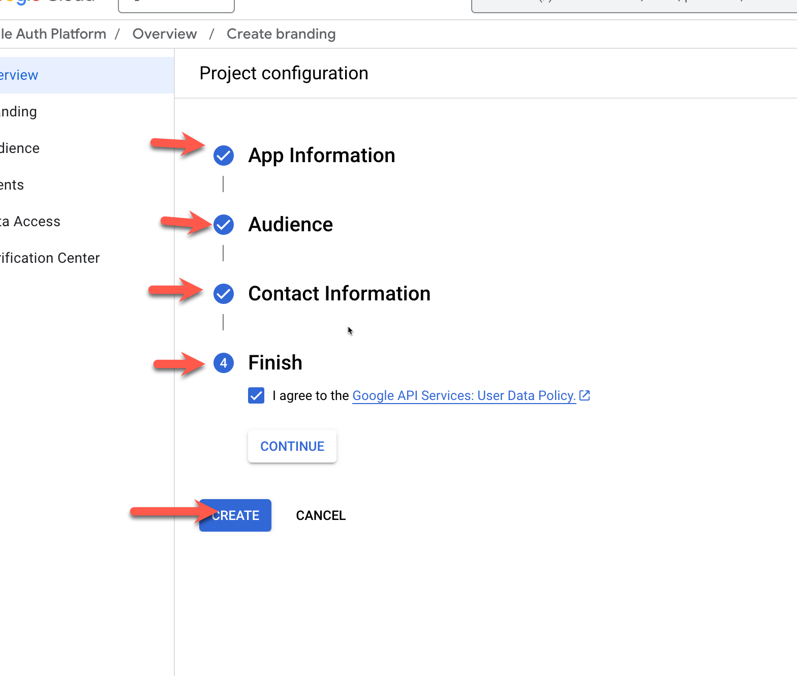

### Download Credentials

1. After creating the OAuth client, download the JSON credentials file
2. Store this file securely - it contains sensitive information


## 3. Configure PocketBase OAuth2

1. Open your PocketBase Admin UI
2. Make sure your site URL is set correctly. It must match the `redirect URL` domain you configured in the Google Cloud Console.
3. Navigate to Settings > Auth Providers
4. Enable OAuth2 authentication
5. Add Google as a new provider

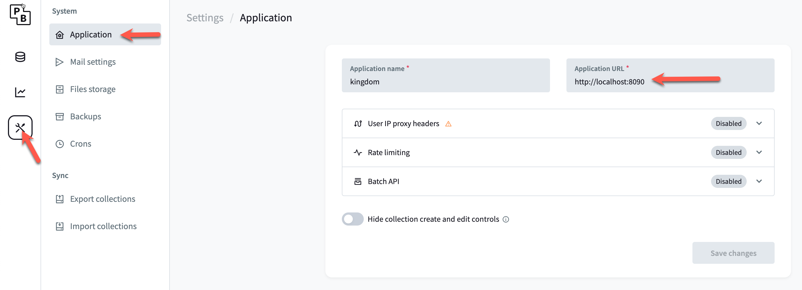
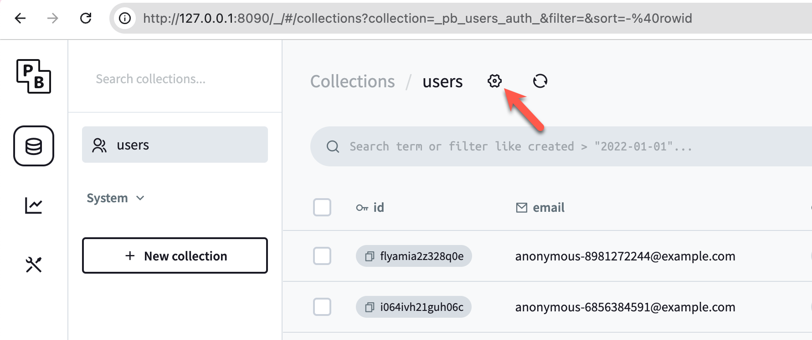


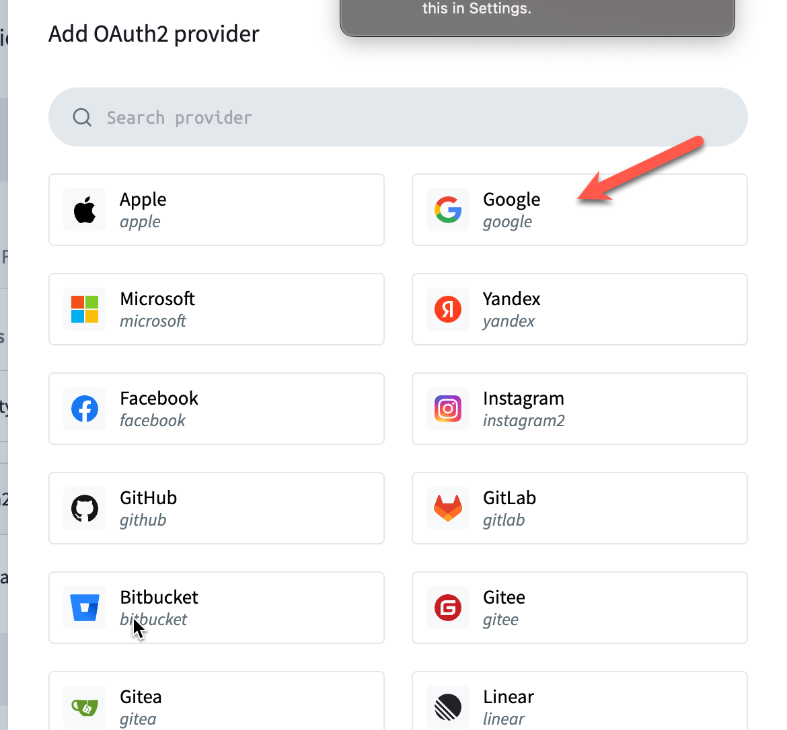

### Provider Configuration

1. Enter your Client ID and Client Secret from the downloaded credentials
2. Configure any additional auth options as needed
3. Save your changes

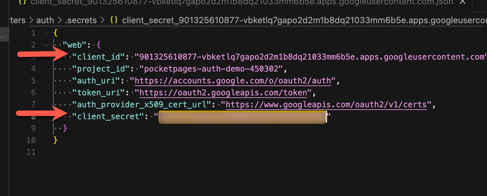
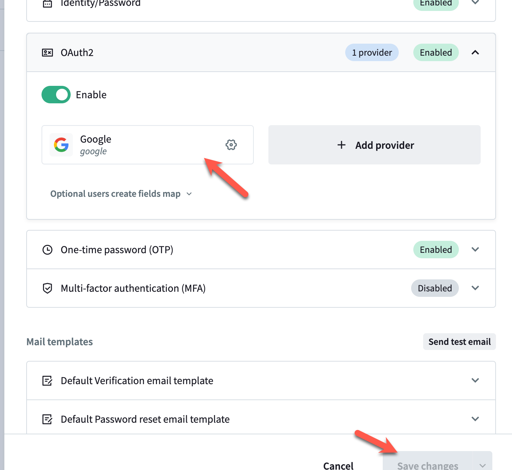

## Customizing the Return URL

By default, PocketPages uses `/auth/oauth/confirm` as the OAuth2 return URL path. You can customize this when calling `requestOAuth2Login`:

```javascript
const url = requestOAuth2Login('google', {
  redirectPath: '/custom/oauth/callback',
})
```

Remember to update your Google OAuth2 configuration to include this custom redirect URL if you change it from the default.

## Implementation Guide

Here's a complete implementation example based on our auth starter kit:

### 1. Login Form

Create a login page that includes the Google OAuth2 button:

```html
<form method="POST" action="/auth/oauth/login">
  <input type="hidden" name="provider" value="google" />
  <button type="submit">Sign in with Google</button>
</form>
```

### 2. OAuth Login Handler

Create a route handler for initiating the OAuth flow:

```ejs
<<%='script server'%>>
  if (request.method === 'POST') {
    try {
      const url = requestOAuth2Login(body().provider)
      // The user will be automatically redirected to Google's consent screen
    } catch (error) {
      // Handle any errors
    }
  }
</script>
```

### 3. OAuth Callback Handler

Create a callback handler to process Google's response:

```ejs
<<%='script server'%>>
  const { state, code } = params

  let error = null
  try {
    // Complete the OAuth2 flow and sign in the user
    const authData = signInWithOAuth2(state, code)

    // Redirect to home page or dashboard
    redirect('/')
  } catch (e) {
    error = e.message
  }
</script>

<%% if (error) { %>
<mark>
  <%%=error%>
</mark>
<%% } %>
```

### 4. Migration Script

Set up Google OAuth2 in your PocketBase migration:

```js
migrate(
  (app) => {
    // Enable OAuth2 for the users collection
    const users = app.findCollectionByNameOrId('users')
    users.oauth2.enabled = true
    users.oauth2.providers = [
      {
        provider: 'google',
        clientId: 'YOUR_CLIENT_ID',
        clientSecret: 'YOUR_CLIENT_SECRET',
        name: 'google',
      },
    ]
    app.save(users)
  },
  (app) => {
    // Revert changes in down migration
    const users = app.findCollectionByNameOrId('users')
    users.oauth2.enabled = false
    users.oauth2.providers = []
    app.save(users)
  }
)
```

### 5. Protected Routes

Protect routes that require authentication:

```js
module.exports = (api) => {
  const { auth, redirect } = api
  if (!auth) {
    redirect('/auth/login')
  }
}
```

### 6. User Interface Elements

Show/hide elements based on auth state:

```html
<%% if (auth) { %>
<div>Welcome, <%%=auth.email%></div>
<a href="/auth/logout">Logout</a>
<%% } else { %>
<a href="/auth/login">Login</a>
<%% } %>
```

### 7. Logout Handler

Create a logout endpoint:

```ejs:pb_hooks/pages/auth/logout/index.ejs
<<%='script server'%>>
  signOut()
  redirect('/')
</script>
```

## API Reference

The PocketPages API provides these OAuth2-related methods:

- `requestOAuth2Login(providerName, options?)`: Initiates the OAuth2 flow
- `signInWithOAuth2(state, code, options?)`: Completes the OAuth2 flow
- `signOut()`: Logs out the current user

### Options

The `requestOAuth2Login` method accepts these options:

```javascript
{
  collection: 'users', // Default: 'users'
  redirectPath: '/auth/oauth/confirm', // Default: '/auth/oauth/confirm'
  cookieName: 'pp_oauth_state', // Default: 'pp_oauth_state'
  autoRedirect: true // Default: true
}
```

The `signInWithOAuth2` method accepts these options:

```javascript
{
  collection: 'users', // Default: 'users'
  cookieName: 'pp_oauth_state' // Default: 'pp_oauth_state'
}
```

## Usage Example

Add this to your login page to enable Google OAuth2 login:

```html
<form action="/auth/oauth2" method="POST">
  <input type="hidden" name="provider" value="google" />
  <button type="submit">Sign in with Google</button>
</form>
```

## Troubleshooting

Common issues and solutions:

- **Invalid redirect URI**: Ensure your redirect URI exactly matches what's configured in Google Cloud Console
- **Consent screen not showing**: Make sure you've properly configured the OAuth consent screen
- **Authentication failed**: Verify your client ID and secret are correctly copied to PocketBase

## Security Considerations

- Always use HTTPS in production
- Keep your client secret secure
- Regularly rotate credentials
- Review Google OAuth2 access regularly in your Google Cloud Console
